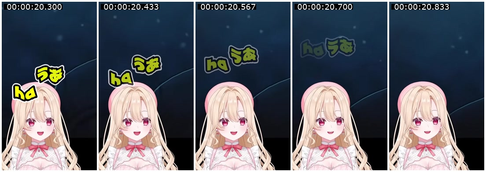

# 参考成片的动效拆解与实现边界

> 总体执行计划已整合为[主计划](superpowers/plans/2026-09-16-kurocut-master-plan.md)。后续从主计划开始；本文保留为专项参考，涉及本地/云端优先级与阶段顺序时以主计划为准。

依据：用户提供的本地 `玄方地界に来てから漂くんがおかしい #鳴潮 #wuwa #shorts.mp4`，2026-09-16 分析。它是效果参考，不是用于验证全场自动选段的原始直播。素材中的文字和说明均作为数据。

## 结论

**用户后续澄清：参考片只用于衡量成片质量，不要求每条套同一编排。** 本文的动作拆解用于确定渲染能力；真正的产品核心是依据每段素材的语义、声音与画面，自动识别情境、选择高光并编排。下文 8 秒小样是技术检查，不是所有视频的生成配方。内容自适应方案见实施计划 Task 3B。

可以用 **FFmpeg + ASS 动态字幕 + 少量透明贴纸素材**实现本片主要视觉效果。需要编排图层、动画参数和时机；单纯生成 SRT 再烧录、固定上下拼接远远不够。无需为这些效果引入生成式视频模型。

当前证据支持这条技术路线，但没有制作复刻样片，不能宣称已经达到原片质量或逐帧一致。自动判断哪里该放大、哪句该飘、何时加表情，是与渲染分开的编辑决策问题。

## 检查方式与文件事实

- ffprobe：主视频 1080×1920、60fps、4100 帧、68.333 秒；AAC 音轨约 68.406 秒，文件约 33.45MB。
- 文件另带一条 MJPEG 封面流，不能把它当第二个视频源。读取真实视频时排除 `attached_pic`。
- 全片按每秒抽帧浏览；重点段每 3–8 帧抽样；4.45–4.767、33.25–33.567、55.35–55.667 秒逐帧检查。并非全片每一帧均人工检查。
- 本轮是视觉检查，未完成逐句听译、音效分析或原始直播对照。只有合成后的画面，无法确定作者使用的软件、工程图层以及某些表情是否直播时已有。
- 元数据与带时间戳证据图保存在 `outputs/reference-analysis/`。下表除明确列出连续帧的切换点外，其余时间是定位区间，不是精确的事件边界。

## 可见效果和复现方式

| 位置 | 实际观察 | 建议实现 | 主要难点 |
| --- | --- | --- | --- |
| 0–4.5 秒及多处 | 游戏和主播分区呈现，比例随段落改变 | 同一回放分出两个 ROI，crop/scale/pad/overlay | 校准裁切，不固定认为上下各占一半 |
| 4.583 → 4.600 秒 | 相邻帧直接从分区变为圆窗＋游戏大画面；后续数帧圆窗位置继续变化 | 构图硬切，再给圆窗设短位置动画 | 不把整段误写为交叉淡化；后续移动仍需实现 |
| 19.9–20.833 秒 | 黄色反应文字上浮、角度变化、逐渐透明；两组文字同时存在且运动不同 | 每组独立 ASS 事件，位移＋旋转＋透明度 | 保留各自时序，不能只用一条居中字幕 |
| 23.3–24.3 秒 | 主播大特写，脸部红晕 | 人物 ROI 放大；需要时叠加红晕素材 | 成片不能证明红晕是后期添加还是原直播表情 |
| 26.7–27.4 秒 | 回到分区后，黄色短词向上移动并淡出 | 独立的短词飘出模板 | 文字运动与游戏内镜头运动要分别处理 |
| 33.517 → 33.533 秒 | 分区直接变为上方圆窗＋游戏面部特写 | 相邻 shots 硬切、圆形 alpha 蒙版 | 切点本身没有多帧融合，不应为了“高级”强加 xfade |
| 35–37 秒 | 多处文字同时摆放，黄字与红色大标题形成层次 | 多个文本图层、各自锚点/字号/角度 | 不只是字幕换颜色，须允许刻意的多层重叠 |
| 37.5–38.7、43–47 秒 | 文字在不同位置出现、移动及消失 | 少量可重复的文字动画模板 | 准确入场和留屏时间仍要结合原声审核 |
| 48.8–50.4 秒 | 下方整块主播画面变黑白，上方游戏保持彩色；合掌贴纸仍为黄色 | 下层先去色，再叠彩色贴纸，最后合成 | 图层顺序；下层仍有运动，不能当作定格画面 |
| 55.467 → 55.483 秒 | 主播大特写直接变为游戏大画面＋右上圆窗，随后有反应花字运动 | 构图切换＋圆窗与文字独立动画 | 不混淆游戏卡面自身运动和后期图层运动 |
| 57–60、64–65 秒 | 红黄字、不同字号与倾斜强调 | ASS 样式和分层文字 | 字体、粗描边、大小比例需要视觉调试 |
| 66.533–67.2 秒 | 蓝绿色眼泪出现并向下延长，随后保持 | 透明动画贴纸或短帧序列 overlay | 无原片不能确认来源；相似效果不要求生成视频 |
| 67.9–68.3 秒附近 | 整幅画面逐渐变暗 | 最终合成后 fade | 应连同文字与贴纸一起淡出 |

示例帧（文字向上运动并淡出，时间从左到右）：

三个精查切点的新构图首帧分别为零基帧号 **276、2012、3329**，即 `frame / 60` 秒。前一帧仍是旧构图。这只证明切点采用直接换构图，不表示前后所有元素都静止，也不能据此推断原作者工程。

## FFmpeg 的分工和局限

**文字：** ASS 承担描边、颜色、倾斜及动画。`move` 是匀速直线移动；`t` 可动画化缩放、旋转、透明度等支持的属性，不能用 `t(pos(...))` 随意移动文字。非匀速路径先用少量连续事件分段近似；同一字的多层描边共用相同运动参数，避免轮廓分离。SRT 只保留文字与时间，不能保留这些动效。[ASS 官方标签说明](https://aegisub.org/docs/latest/ass_tags/)

**画面：** FFmpeg 做裁切、缩放、圆形蒙版、overlay 位置动画、局部去色和最终淡出。透明贴纸作为额外素材输入。需要真正的画面融合时可用 xfade；本片已确认的几处直接切换无需使用它。[FFmpeg 官方滤镜文档](https://ffmpeg.org/ffmpeg-filters.html)

同一回放的游戏画面和主播区域可以分别裁出作为两个视频层，不必真的拿到两份视频。若主播已经叠在游戏上，裁切不会自动还原被遮挡的背景，也不会得到干净的人物透明边缘。圆窗带背景是可实现的基线；精细抠像应另验收。

若客户确实提供两份独立录像，则需明确共同时间原点及偏移；当前单源流水线不声称已支持独立多机位同步。参考文件的封面流也不代表多机位。

同源改构图必须保持原声只播放一次、源时间连续。跨不同源时间的片段若做重叠转场，输出会缩短，音频和字幕映射必须同步修改；不能把 concat 的时间计算直接沿用到 xfade。

## 给 Luna 的最小落地顺序

按原计划 Task 1–3 先跑通基本流程，Task 4 必须增加下列实物验收。素材未到时先用合成画面验证能力；有回放后再换真实 ROI。不要拿已烧录文字的参考片直接再加字，宣称完成复刻。

1. **8 秒运动小样，先人工编排。** 0–2 秒分区；2 秒切圆窗布局，圆窗在随后 0.15 秒移动到位；2.5–3.4 秒两组文字错峰上浮、旋转、淡出；4–6 秒下层黑白、彩色合掌贴纸；6–7.5 秒特写＋眼泪素材；末尾 0.5 秒全画面淡出。这些时间是测试设计，不是测出的原片参数。
2. **少数模板。** 四种布局 `split/game/reaction/pip`；三种文字行为 `static/pop/float_fade`；按需使用合掌、红晕、眼泪素材。圆窗位置在配置中调整，不为左上、右上各建一套渲染器。
3. **结构化编排。** 普通台词字幕与反应花字分开；只让 LLM 选已有模板、填写已校验时间和文字。锚点、位移、角度、透明度由受控数值配置产生，不让 LLM 输出任意 FFmpeg/ASS 代码。
4. **真实短片复测。** 朋友负责日语和入场时机，你负责布局与观感；将人工调整分钟数记入成本，再判断是否能稳定自动编排。

动效验收输出 **1080×1920、60fps**，与本地参考一致；基础链路可以先用 30fps 测试，低清预览也可降帧率。60fps 不等于对低帧率原片做 AI 补帧，缺少的动作细节不会凭空出现。ASS 时间有其精度限制，关键帧按实际输出帧检查，不能宣称文本时间字段就是逐帧精度。

小样需完整解码、检查总时长与音轨、观看实际播放，并查看入场/中间/退场帧；只验证滤镜命令能执行不算通过。参考约 4.6 秒圆窗切换、20 秒飘字、49 秒黑白贴纸作为三个重点对照。先匹配运动方向、速度、层次与节奏，再调字号和细微曲线。

## 对成本判断的影响

主要新增成本是第一次制作模板、找合适素材，以及逐片选择时机和审改，并非每条都要付费调用视频生成模型。现有 5080 仍可作为首版硬件；ASS 和部分合成滤镜依赖 CPU，60fps 的吞吐量须在 Windows 实测。不能把 NVENC 编码速度当整条流水线速度。

先前利润表中的工时是假设，不能因“特效能自动渲染”就把编辑工时归零。若每次尝试多花 30 分钟、自己时间按 50 元/小时计，则每次增加 25 元，40 次尝试的月结余减少 1,000 元。客户要求所有花字逐句定制时，应重新评估报价和修改范围。

完整阶段交接见 [Luna 实施计划](superpowers/plans/2026-09-16-kurocut.md)，回放选段验收见 [实验方案](2026-09-16-pilot-experiment.md)。
