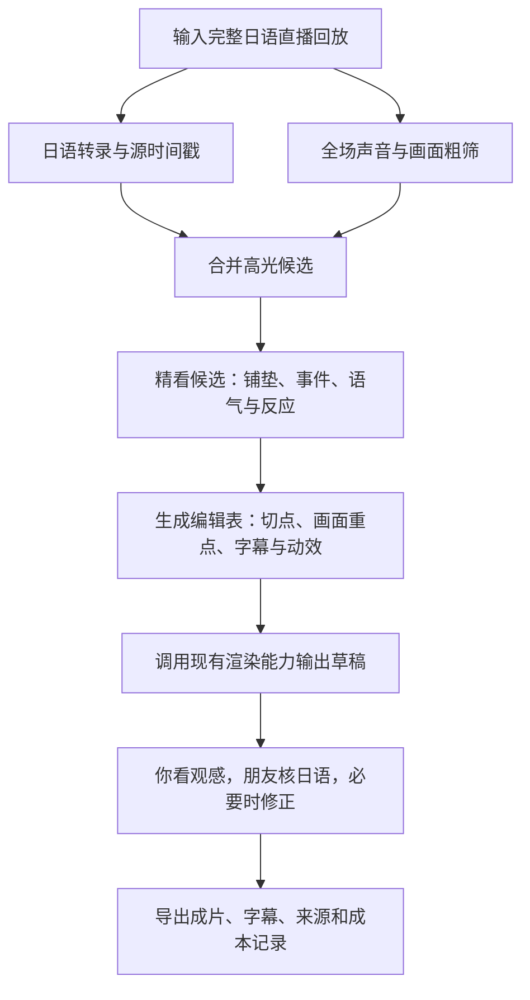

# KuroCut 成片流程与开源复用决策

> 总体执行计划已整合为[主计划](superpowers/plans/2026-09-16-kurocut-master-plan.md)。后续从主计划开始；本文保留为专项参考，涉及本地/云端优先级与阶段顺序时以主计划为准。

2026-09-16。当前项目只有调研、计划与参考抽帧，没有接入或跑通任何开源成片系统。此前方案复用了底层模型/工具，但计划自行编写过多业务流程。更新策略：**先验证现成项目，再只补缺失能力。**

## 最终工作流

用户提供原片与初次主播版式配置后，B 到 G 的目标是自动运行。人工审核是交付质量控制，不要求用户逐句填写特效。平静、有趣的聊天与高能操作应该产生不同编排，允许不加动效。

| 阶段 | 实际产物 | 优先复用 | 需适配的部分 |
| --- | --- | --- | --- |
| 输入与项目状态 | 原片信息、处理状态 | 选定基础项目现有界面/状态 | 本地路径、任务记录，不另写下载器 |
| 日语转录 | 日语文本、可追溯时间戳 | 基础项目 ASR；必要时使用 faster-whisper | 游戏专名、原片时间映射、语言质量 |
| 初筛 | 候选片段和证据 | 现有 LLM 选段＋音视频信号 | 全场视觉覆盖、合并去重，不只抓响声 |
| 候选精看 | 铺垫/事件/反应与不确定项 | 一种音视频理解 API 或已验证本地路径 | 日语语境、角色关系、事件真实性 |
| 编辑决策 | 结构化编辑表 | 现有编辑决策结构/提示词 | 画面重点、字幕强调、动效是否必要 |
| 渲染 | 完整竖屏 MP4 | 项目渲染器、FFmpeg、ASS | 游戏/主播双区、圆窗、反应花字及贴纸 |
| 审改与导出 | 最终片、日语字幕、中文审片说明 | 现有审核界面 | 缺失的中文说明、改稿后重新渲染 |

## 已核对的项目

### 1. FunClip：优先验证的基础项目

官方项目有本地 Gradio 界面、识别、字幕、按文本/时间选段与 LLM 辅助切片。当前文档提供 Fun-ASR-Nano 日语路径、SenseVoice 路径，以及可选 TwelveLabs Pegasus 视频理解集成；后者是云端服务，不是开源模型免费本地运行。[官方仓库](https://github.com/modelscope/FunClip)

实际读取了 `launch.py`、`videoclipper.py` 和 `llm/twelvelabs_api.py`：Pegasus 分支确实接收视频、本地文件会上传，返回区间后连接现有 AI Clip；其他普通文本分支主要接收 SRT。不能仅换一个文本模型名称就声称模型看到了视频。核对快照：`7e4b15fe2233680edaf5ec92bf18e2071e499b69`。

**适合复用：** 现成界面、转录到切片的流程、视频理解接入位置、字幕/区间导出。先测试其原有路径，不同时重写 ASR、UI 和任务系统。

**必须验证：** 日语模型返回的时间戳能否支持字幕和切点；模型支持日语不代表任意文字精确剪切都可用。代码会清理识别中的标签，若要使用 SenseVoice 情绪/声音事件，需保留原始输出另存，不能从清理后的字幕假设标签仍在。当前审阅未证明已有游戏/VTuber 自适应构图及目标花字动画；这些属于预计适配项。没有实测 Windows 5080。

### 2. video-use：编辑表与渲染工具的复用候选

项目围绕编码助手编排素材，包含转录、编辑决策表（EDL）、FFmpeg 渲染、字幕、动画叠加和切点检查。它主要依赖文字转录及按需画面合成图，不是把完整视频交给模型联合听看；默认转录使用 ElevenLabs。[官方仓库](https://github.com/browser-use/video-use)

已读取 `helpers/render.py`，确认是消费 EDL 的实际渲染代码，包含输出字幕时间映射、片段拼接、叠加层与帧率处理。快照：`9575612f066aa517354790a645fd90f9f95a743b`。

**适合复用：** 如果 FunClip 渲染改造不合适，优先试其现有脚本和编辑表，不另造完整编辑器。日语断句、游戏双区与精细 ASS 动画仍需验证/改造。不要直接套用默认英语两词字幕、自动调色或自动删停顿，也不把它的交互助手模式直接视作无人值守生产线。

### 3. Clips Kitty：完整本地应用的对照候选

已有本地转录、选段、竖屏裁切、可编辑字幕、审核界面与自然语言改片功能，值得作为开箱产物对照。其说明中的多模态主要包括响度、声音突发、运动、切镜和脸部区域变化，交给文本 LLM 综合评分；这与深度理解游戏事件的视觉模型不是同一能力。[官方仓库](https://github.com/ColinGPT9/clips-studio)

已读取 `core/pipeline.py`，确认转录→分析→渲染链路和已有状态记录，不只参考宣传页。快照：`93f63fd40b5b7a141a7b7e6a800c224f20acc3e2`。真人跟踪机制对 VTuber 和游戏混合画面是否有效尚未验证。完整应用功能较多，首轮不与 FunClip 全量合并，也不因我们偏好 JSON 而重写其已有数据库。

### 4. VideoLingo：字幕专项备选

擅长识别、字幕切分、对齐、翻译和配音，有 Windows 启动路径。适合字幕质量成为瓶颈时对照，当前日语原声项目不必引入整套配音/翻译链路。没有证据表明它独立覆盖整场游戏高光选择和内容自适应动效。[官方仓库](https://github.com/Huanshere/VideoLingo)

### 5. CutClaw：研究参考，暂不作为底座

项目会解构长视频、生成镜头计划并渲染，但主目标是与音乐同步的蒙太奇，叙述驱动和视觉混合仍列为后续方向。用户要保留日语直播语境和反应，首轮不承担改造整个研究框架的成本。[官方仓库](https://github.com/GVCLab/CutClaw)

## 情绪模型的具体位置

SenseVoiceSmall 官方支持日语识别、情绪与声音事件标签，可作为本地声音线索候选；其 README 的情绪评估描述以中英文测试为主，不能据此宣称已经在日语 VTuber 上准确。游戏音效、表演语气也可能干扰。先对同一小样测试，标签只作线索，最终结合画面和台词。[官方项目](https://github.com/QwenAudio/SenseVoice)

不为“技术丰富”而同时常驻多个模型：基础 ASR 能满足转录就保留；音视频理解 API 已能提供可用声音信息时，暂不额外接 SenseVoice。需要全本地或实际错漏明显时再对照。

## 具体选择：先一个底座，再一个必要扩展

**首选试跑 FunClip；Clips Kitty 是完整本地备选；video-use 是编辑/渲染复用候选。** 这是基于文档与部分源码的工程判断，不是效果评测排名。

不要把五个项目都装进同一个环境。先用 FunClip 的独立环境处理 60–90 秒真实日语小样，再处理 10–20 分钟回放片段。如果它能稳定转录、保留时间戳、输出可审粗剪，就沿用它，仅增加内容自适应编排和必要渲染能力；若核心路径不适配，记录具体失败，再试完整本地备选。局部渲染缺失可测试 video-use 的脚本，不把第二个应用整体拼进去。

没有发现经本项目实测、开箱即可稳定产出参考质量的完整方案。因此不承诺“装一个仓库就完成”；也不应因为最后一层需要定制，就把前面所有成熟能力重写。

许可证只是选用记录：核对页面中 FunClip/video-use 为 MIT、VideoLingo 为 Apache-2.0、Clips Kitty 为 AGPL-3.0；实际采用须记录具体版本和依赖/模型许可，不把它们统称为同一授权。内部出片与改造分发软件应分别核对，不将成片收入自动等同于软件授权费用。

## Luna 下一任务

执行主实施计划新增的 **Task 0：开源底座试跑与选择**。先交付现成项目的运行结果、真实粗剪、失败日志与复用清单，再决定哪些模块需要编写。旧计划中的固定文件名是底座未确定时的候选设计，不能当作强制重建清单。
